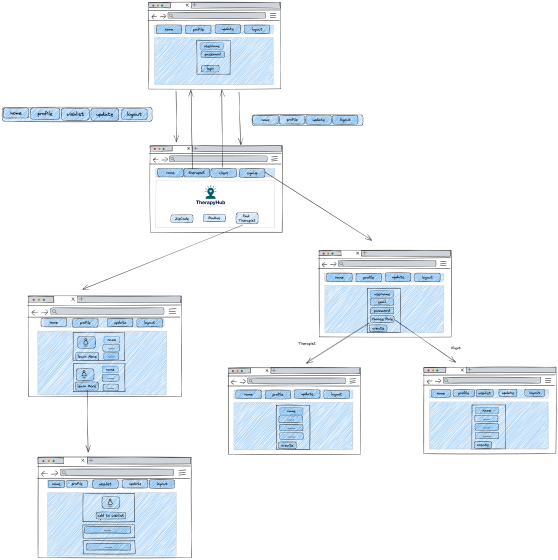

## TherapyHub

Created by:
* Kamron Poosti
* Nancy Chavez
* Ana Maria Pedroza
* Will Howe
* Jacob Sullenszino

## Project Description
 TherapyHub is a comprehensive, user-friendly web-application that streamlines the research process by providing a one-stop-shop for finding the perfect therapist, from searching by location to narrowing down your search by therapist specialty.

 * TherapyHub is a web-application that allows users to find a therapist that fits their needs and it allows therapist a place to promote themselves.
 * Users can sign up, log in, and log out of an account.
 * Logged in users can create and view a therapist Wishlist.

## Initializing the Project
1. Fork and clone this project using this link: https://gitlab.com/team-swank/therapy-hub
2. Copy and clone HTTPS link into a directory of your choice
```
git clone <insert HTTPS>
```
3. Open a command terminal and cd into your chosen directory
4. input the following commands into the terminal:
```
docker volume create postgres-data
docker volume create pg-admin
docker-compose build
docker-compose up
```
5. if using an apple computer with a M1 or M2 chip use the following command instead of docker-compose build:
```
DOCKER_DEFAULT_PLATFORM=linux/amd64 docker-compose build
```
6. Ensure all containers are running properly in your Docker Desktop
7. To view app in your browser, navigate to: http://localhost:3000
8. To access all the FastAPI endpoints, navigate to: http://localhost:8090/docs

## Testing
* Run `python -m pytest`

## Features
* When clients access the app, they will be able to sign up for an account.
* A client will be able to create a profile
* When therapists access the app, they will be able to sign up for an account.
* A therapist will be able to create a profile
* Users will have the ability to log in, logout, and create a Wishlist.
* Users will have the ability to search through a list of the therapists by inputting a Zip code and radius.
* The user will be able to further narrow their search by adding filters for specialties and payment options.

## Context Map


## How to Use:
### Signing up
1. To sign up, you begin on clicking the "Sign Up" link in the dropdown on the Navbar.
2. Fill out the form, the last item is a drop down for the user to select if they are either a therapist or a client.
3. Once you submit the form you will be rerouted to the relevant next page to fill out a form for either the Client profile or Therapist profile.

### Therapist Sign up
1. Fill out the form.
2. there are two multiselect drop downs one for specialties and one for payment methods. Select as many as you would like.
3. the picture takes in a URL for the picture.
4. Once you submit the form you will be redirected to your profile.

### Therapist Profile & Update Profile
1. You can be taken to the therapist profile by clicking on the "Profile" link in the navbar, when logged in.
2. You can update your profile by clicking on the "Update Profile" link in the navbar.

### Client Sign up
1. Fill out the necessary information.
2. Once you submit you will be rerouted to the home page.

### Client Profile & Update Profile
1. You can be taken to the client profile, by clicking on the "Profile" link in the navbar, when logged in.
2. You can update your profile by clicking on the "Update Profile" link in the navbar.
3. The client profile page contains a link "You can view your Wishlist here" to access their Wishlist.
4. the client profile page also contains a link "Haven't found a therapist you love? Keep browsing!" which will redirect the client to the home page, to enter information to search for a therapist.

### Using the Homepage & Search
1. To utilize the search you enter a valid zip code in the zip code input and a number in the radius input.
2. when you hit "Find Your Therapist!" you will be rerouted to the list of therapists
3. you can change your search area by updating the zip code and radius.
4. you can further filter your search by clicking on the "Filter" dropdown.
5. The dropdown filter uses a some component for each of the specialties and payment. What that means is it will show therapists that have any of the matching specialties and therapists that show any of the matching payment methods.
6. if you click on "Learn More" on the therapist card, you will be taken to the therapists profile page.

### Client Wishlist
1. To access the Wishlist, you can click on the "Wishlist" link in the navbar, when logged in as a client.
2. To add therapists to your Wishlist, when viewing a therapist's profile from the search there will be a button "Add to Wishlist" to add the therapist to your Wishlist.
3. When the person is added to the Wishlist, the button will turn to "DELETE", which will remove the therapist from your Wishlist.
4. Now when viewing the Wishlist, you will have a drop down of the therapist cards, with a button "Learn more!" to take you to the therapist's profile or a button "DELETE" to delete the therapist from the Wishlist.

### Logging In & Logging Out
1. To Login as a Therapist, click on the "Therapist" link in the Navbar dropdown.
2. When a therapist first logs in, they will be redirected to the home page.
3. To Login as a Client, click on the "Client" link in the Navbar dropdown.
4. When a client first logs in, they will be redirected to their profile page.
5. To Logout, click on the "Logout" link in the Navbar dropdown.

### Footer of website
1. The footer of the website has autogenerated quotes that will generate a new quote when the browser is reloaded.
2. The footer contains the Co-Founders of the website.
3. The footer contains links to an "About Us" and "Contact" page.

### Documentation
* Standup notes - https://docs.google.com/document/d/1ldispeQHwaxoWK98EUU56EaabzE8Z2HpqtmfMBucG8k/edit?usp=sharing
* Project Issues Notes - https://docs.google.com/document/d/1rS4UtA-bpi5PUjzWjde0APUBbO1GoSFtD3XRs1J-fXM/edit?usp=sharing